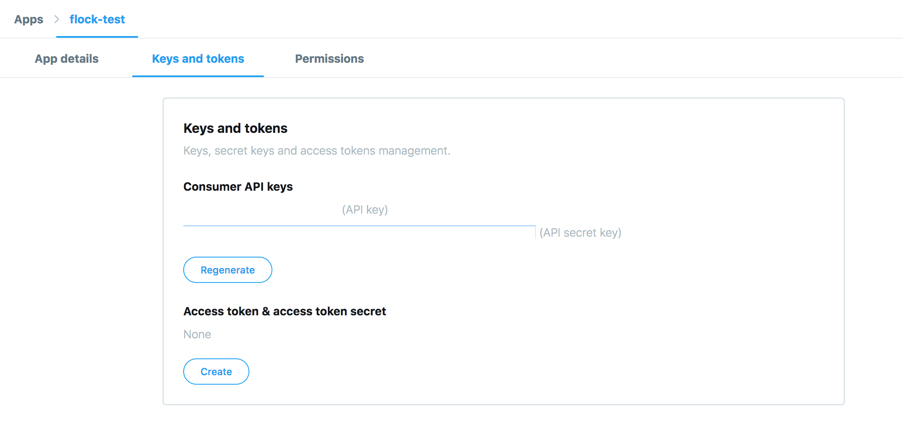

# Flock

Flock loads real Twitter streams into Dgraph to make use of graph traversals.

This example follows the [Flock using Go](https://github.com/dgraph-io/flock) closely.

Flock has two parts :
- [*Tweet loader*](./index.js) - It connects to [realtime Tweets][tweetsapi] via the
Twitter Developer API and loads a graph model of Twitter into Dgraph via mutations.
- [*Query client*](./client/index.js) - It runs interesting graph queries on the Tweets
data stored in Dgraph.

Here is the graph schema of Flock:


[tweetsapi]: https://developer.twitter.com/en/docs/tweets/sample-realtime/overview/GET_statuse_sample

# Running Flock

## Obtaining Twitter credentials

We need to create a Twitter developer account and an app to be able to fetch a stream
of Tweets using their APIs. Let's start with how to create a Twitter developer account.

- Apply for a Twitter developer account [here](https://developer.twitter.com/en/apply/user)
and follow the instructions. The series of steps would end with your email verification.
- Create a Twitter app from [this link](https://developer.twitter.com/en/apps/create).
  All fields are `not` required.
- You'll be redirected to the App details tab after creating the app. Go to the
`Keys and tokens` tab and create new access and secret tokens.

- Create a copy of the credentials template.
  ```sh
  cp credentials-template.json credentials.json
  ```
- Open the `crendentials.json` file and replace the placeholders with the keys from
the Twitter app's `Keys and token` tab.

---
## Setup

- Clone the repository.
```sh
$ git clone https://github.com/dgraph-io/dgraph-js.git
$ cd dgraph-js/examples/flock
```

- Export the persistent data directory. Since Dgraph is run using Docker containers, it
is nice to mount a directory on the host machine to persist the data across multiple runs.
```sh
$ mkdir ~/dgraph
$ export DATA_DIR=~/dgraph
```

- If you're running Linux, you can add the current user to the `docker` group to use
Docker as a non-root user. The `newgrp` command creates a new terminal session.
It is necessary after the user modification to see the effects.

```
$ sudo usermod -aG docker $USER
$ newgrp docker
```

- Ensure that `credentials.json` with the valid Twitter credentials exist in
the root directory of Flock.

- Start the Dgraph servers and Ratel with Docker Compose. Visit http://localhost:8000
on your browser to view the UI.

```sh
$ docker-compose up
```

- On another terminal, start Flock:

```sh
$ docker-compose -f docker-compose-flock.yml up
```

Flock will begin printing out periodic log messages mentioning its
loading rate. You're good to go if you see the `Commit Rate` higher
than 0/sec, which means data has been successfully committed to
Dgraph.

A few minutes of running Flock is sufficient to get enough data for
some interesting queries. To stop running Flock, press Ctrl+C on the
terminal running Flock.

```sh
$ docker-compose -f docker-compose-flock.yml up
...
<Ctrl+C>
Killing flock ... done
```

---
